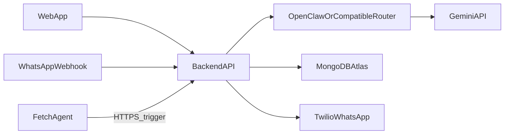

# 24-hour hackathon plan: ADHD execution coach (master)

## Constraints (24h)

- **Ship one vertical slice**: user enters a goal on the web → gets a breakdown → can text WhatsApp when stuck → **Fetch.ai-driven proactive nudges** (e.g. post-plan check-in) → sees progress in the app.
- **Defer everything else**: fancy analytics, multi-user social, full calendar sync, polished mobile apps, complex multi-agent swarms beyond one reminder loop.
- **AI stack**: OpenClaw (or OpenAI-compatible layer) with **Google Gemini** for **language + JSON plans/nudges**; keep prompts **JSON-shaped** so web + WhatsApp share one contract.
- **Agent stack (mandatory)**: **Fetch.ai** owns **time-based / proactive orchestration** (trigger follow-ups); it does **not** replace Gemini for generating plan text — it **calls your backend**, which may then call Gemini for copy or use a stored template.
- **ElevenLabs**: **out of scope** (ignore).
- **Safety**: non-clinical disclaimer + crisis redirect text in web + WhatsApp (judges care).

## MVP scope (must ship)

| Surface | What ships |
|---------|------------|
| **Web** | Goal input, AI breakdown (tiny first step + 2–4 subtasks), optional energy/time fields, simple “session” start/end with reflection |
| **WhatsApp** | `start`, `stuck`, `done` (and maybe `plan`) → same backend logic as web; persist last task context per user |
| **Data** | MongoDB Atlas: users (phone/web id), tasks, sessions, **pending reminder jobs** (when to nudge, channel, task id), WhatsApp thread state |
| **Deploy** | Vultr: one backend + one frontend (static or SSR) |
| **Fetch.ai (required)** | At least one **agent/workflow** that fires on a schedule or event and hits your API to **send a WhatsApp nudge** (or enqueue it) — proves “autonomous agent” for the sponsor track |

## Fetch.ai vs Gemini (division of labor)

| Layer | Responsibility |
|--------|----------------|
| **Gemini (via OpenClaw)** | Natural language + structured JSON: **plan**, **stuck nudge** text, **two-minute re-entry** steps when invoked |
| **Fetch.ai** | **When** to act: e.g. “15 minutes after plan created, ping user if no `session/end`”; **invokes FastAPI** with a signed payload — your backend then sends Twilio message + optionally asks Gemini for fresh text |

Do **not** try to replace Gemini with Fetch for planning copy in 24h; **do** make Fetch visible in the **demo** as the **proactive** layer.

## Architecture (minimal)



**Fetch.ai**: Expose e.g. `POST /internal/reminders/fire` with **shared secret header** + body `{ user_id, task_id, reminder_kind }`. Handler loads task, optionally calls Gemini for one short line, sends via **Twilio** outbound.

## Tech stack (locked for team)

- **Backend**: Python **FastAPI** (Pydantic models = JSON contract).
- **Frontend**: **Vite + React** + TypeScript (`VITE_API_URL`).
- **DB**: MongoDB Atlas + Motor or Beanie (or PyMongo).
- **WhatsApp**: Twilio webhook (or Meta) hitting FastAPI.

## API JSON shape (single contract for web + WhatsApp)

### `POST /plan` — request body

```json
{
  "goal": "Finish my resume this weekend",
  "horizon": "today",
  "available_minutes": 90,
  "energy": "medium"
}
```

### `POST /plan` — response body (example)

```json
{
  "plan_id": "uuid-returned-or-generated",
  "summary": "One sentence what success looks like.",
  "tiny_first_step": {
    "title": "Open the doc and write the first line of your header",
    "description": "2 minutes max; no formatting required.",
    "estimated_minutes": 2
  },
  "steps": [
    {
      "id": "1",
      "title": "Brain dump bullet achievements",
      "description": "List 5 bullets without editing.",
      "estimated_minutes": 15,
      "suggested_window": {
        "label": "Today evening",
        "start": "2026-03-21T19:00:00-07:00",
        "end": "2026-03-21T19:30:00-07:00"
      }
    }
  ],
  "implementation_intention": {
    "if_condition": "When I sit at my desk after dinner",
    "then_action": "I set a 10-minute timer and only do the bullet list"
  },
  "safety_note": "Non-clinical tool. If you are in crisis, contact local emergency services or 988 (US)."
}
```

### `POST /nudge`

- **Request**: `{ "task_id": "...", "context": "stuck on formatting", "last_step_id": "1" }`
- **Response**: `{ "nudge_type": "reentry", "message": "...", "two_minute_action": "..." }`

### `POST /session/start` and `POST /session/end`

- Minimal: `task_id`, `started_at`, `ended_at`, `reflection` (`done` | `blocked` | `partial`).

### `POST /internal/reminders/fire` (Fetch.ai → FastAPI; **not** public)

- **Auth**: header e.g. `X-Internal-Key` matching server env.
- **Body** (example): `{ "user_id": "...", "task_id": "...", "reminder_kind": "check_in_15m" }`.

**Prompt rule**: Ask Gemini to output **only JSON** matching the Pydantic schema; FastAPI validates; on failure, one retry with “fix JSON only”.

## 24-hour schedule — split four ways

Assume **~20–22h effective**. **Sync checkpoints**: start (0h), mid-build (~8h), integration (~14h), demo prep (~18h) — 15 min each, blockers only.

| Hours | **T1 — Frontend** | **T2 — Backend** | **T3 — WhatsApp** | **T4 — DevOps / Fetch** |
|--------|-------------------|------------------|-------------------|-------------------------|
| **0–2** | Scaffold Vite+TS; pages: Goal, Plan, Session | FastAPI skeleton; stub `POST /plan`; stub `POST /internal/reminders/fire` (401 without key) | Twilio sandbox + webhook stub; test outbound once | Mongo Atlas + Vultr; Fetch project + HTTP trigger docs |
| **2–8** | Real `/plan` UI; render `steps[]`, `tiny_first_step` | Gemini + Pydantic + Mongo; `POST /nudge`; `/internal/reminders/fire` + Twilio outbound | Webhook commands → T2 endpoints | Deploy public HTTPS; first Fetch agent hitting callback |
| **8–14** | Plan → session UI | Persist sessions + reminder metadata; auth for demo | Full loop: plan → nudge | E2E: Fetch → WhatsApp |
| **14–18** | Polish + disclaimers | Harden internal route | Templates | Pitch: Gemini = copy, Fetch = proactive |
| **18–22** | Freeze + record | Freeze API | Freeze webhook | Record backup demo |
| **22–24** | On-call | On-call | On-call | Hotfix deploy |

**Schema ownership**: **T2** implements Pydantic; **T4** keeps README in sync; **T1** mirrors TypeScript types (optional: OpenAPI codegen).

## Judging narrative (~2 minutes)

1. Overwhelming goal in web → instant tiny plan with if/then (Gemini).
2. **Fetch.ai** fires (e.g. 15m check-in) → proactive WhatsApp nudge via backend.
3. Phone: “stuck” → 2-minute re-entry step (Gemini).
4. Web shows session completed — persistence (Mongo).

## Risks and mitigations

| Risk | Mitigation |
|------|------------|
| WhatsApp setup slow | Twilio sandbox hour 0; fallback = web-only chat |
| Fetch.ai integration unclear | Smallest path: HTTP callback + secret; one reminder type (`check_in_15m`) |
| AI latency | Short prompts, `max_tokens` cap |
| Scope creep | Lock MVP at hour 2 |

## Starter repo (this codebase)

This repository includes a **minimal integrated template** (`backend/` + `frontend/` + `docs/`). See root [`README.md`](../README.md) for run and test instructions.
