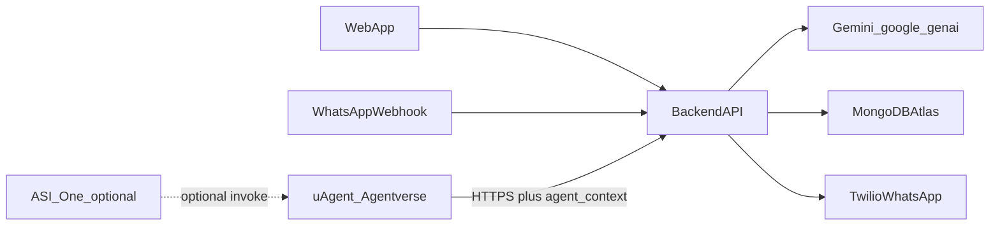

# 24-hour hackathon plan: ADHD execution coach (master)

## Constraints (24h)

- **Ship one vertical slice**: user enters a goal on the web → gets a breakdown → can text WhatsApp when stuck → **Fetch.ai-driven proactive nudges** (e.g. post-plan check-in) → sees progress in the app.
- **Defer everything else**: fancy analytics, multi-user social, full calendar sync, polished mobile apps, complex multi-agent swarms beyond one reminder loop.
- **AI stack**: **Google Gemini** via the official **`google-genai`** Python SDK (no OpenClaw gateway for this hackathon — fewer moving parts). **JSON-shaped** prompts/responses so web + WhatsApp share one contract.
- **Agent stack (mandatory)**: **Fetch.ai** (`uAgents` + **Agentverse**; optional **ASI:One** surface) owns **proactive orchestration** — see [Fetch ecosystem vs our stack](#fetch-ecosystem-asione-uagents-agentverse-vs-our-stack). It does **not** replace Gemini for primary planning copy; it **calls your backend** with optional **structured metadata** so you can **snooze**, **replan**, or soften messages (**strong integration story** — [below](#strong-integration-story-level-b--chosen)).
- **ElevenLabs**: **out of scope** (ignore).
- **Safety**: non-clinical disclaimer + crisis redirect text in web + WhatsApp (judges care).

## MVP scope (must ship)

| Surface | What ships |
|---------|------------|
| **Web** | Goal input, AI breakdown (tiny first step + 2–4 subtasks), optional energy/time fields, simple “session” start/end with reflection |
| **WhatsApp** | `start`, `stuck`, `done` (and maybe `plan`) → same backend logic as web; persist last task context per user |
| **Data** | MongoDB Atlas: **`plans`** (saved **`PlanResponse`** + metadata), **`sessions`**, users / WhatsApp thread state, **pending reminder jobs** (when to nudge, channel). **Do not** add a separate **`tasks`** collection for MVP — “task” in conversation means the **plan** row keyed by **`plan_id`**. |
| **Deploy** | **Render**: FastAPI backend (HTTPS). **Vercel**: Vite/React static frontend. `VITE_API_URL` → Render URL; **CORS** includes Vercel prod (and preview if used). |
| **Fetch.ai (required)** | **uAgent** published on **Agentverse** that fires on a schedule/event and **POST**s to your API (with optional **`agent_context`**) — proactive nudge + **strong story** for judges |

**API vs Mongo naming:** Request bodies use **`task_id`** (e.g. `/session`, `/nudge`) — for MVP **`task_id` === `plan_id`** from **`POST /plan`**. T1 keeps rendering **`PlanResponse`** as today; renaming to **`plan_id`** everywhere is optional and needs T1 + OpenAPI agreement.

## Fetch ecosystem (ASI:One, uAgents, Agentverse) vs our stack

These are **Fetch.ai** concepts from the sponsor stack; they map to our app like this:

| Fetch concept | What it is | Role in *this* project |
|---------------|------------|-------------------------|
| **uAgents** | Python framework for **agents** that use Fetch protocols and can integrate with HTTP / other agents | Build the **proactive reminder agent** that triggers **`POST /internal/reminders/fire`**. The uAgent is **orchestration + scheduling + optional metadata** — not your primary LLM. |
| **Agentverse** | **Registry / discovery / deploy** for agents (“where the agent lives” for the ecosystem) | **Publish** your uAgent so the demo can show: *our coach agent is live on Agentverse*. Judges can see discovery + your HTTPS callback story. |
| **ASI:One** | Fetch’s **agentic assistant / chat** layer that can connect to ecosystem agents | **Optional** for MVP. Your users mainly hit **web + WhatsApp → FastAPI**. If time allows, add a slide: ASI:One could **invoke** your published agent or backend — do **not** block the core demo on ASI:One unless the track requires it. |

**Where “intelligence” lives**

- **Gemini (backend)** — plans, nudges, **replanning** smaller steps, compassionate copy (JSON-shaped responses).
- **User replies** (“I’m burnt out”) — arrive on **Twilio → FastAPI**, not through Fetch. Backend updates **Mongo** (energy, snooze, flags) and may call Gemini to **split or soften** the plan.
- **Fetch uAgent** — decides **when** to check in and can attach **`agent_context`** (e.g. energy hint, push-back minutes) so the backend can **persist schedule changes** and generate the right WhatsApp line.

## Fetch.ai vs Gemini (division of labor)

| Layer | Responsibility |
|--------|----------------|
| **Gemini (backend, `google-genai`)** | Natural language + structured JSON: **plan**, **stuck nudge** text, **two-minute re-entry**, and **replan** when backend asks (e.g. smaller steps after burnout) |
| **Fetch (uAgent + Agentverse)** | **When** to act and **optional structured hints** to the backend: fire **`/internal/reminders/fire`** after e.g. 15m if no `session/end`; published agent proves the sponsor integration |

Do **not** replace Gemini with Fetch for core planning copy in 24h; **do** show **uAgents + Agentverse** in the **demo** as the **proactive agent layer**.

## Strong integration story (Level B) — **chosen**

We use more than a dumb timer. The **uAgent** sends a **rich callback** so **FastAPI** can:

1. Load **task + user** from **Mongo** (session completed? snooze? burnout flag from last WhatsApp?).
2. Use **`agent_context`** (optional) to **push back** the next nudge (`push_back_start_minutes`), request **smaller steps** (`replan_intensity`), or set **energy** hints for Gemini.
3. Call **Gemini** to produce the **WhatsApp message text** (or a shorter plan) when `replan_intensity` is `smaller_steps` / `lighter`.
4. Send via **Twilio** outbound and update **`next_reminder_at`** / plan version in Mongo.

**User says “burnt out” in WhatsApp** → handled on **`POST /webhooks/twilio`** → T2 persists state → **next** uAgent or reminder respects softer pacing (metadata can also be mirrored into `agent_context` if your uAgent reads backend state before firing — follow Fetch docs for agent memory).

This keeps **one source of truth** (FastAPI + Mongo) while the **Fetch stack** provides the **sponsor-visible agent** and **scheduling**.

## Architecture (minimal)



**Internal callback**: `POST /internal/reminders/fire` with **shared secret** + body including optional **`agent_context`** (see API section). Handler may **replan** / **snooze** / send Twilio message.

## Tech stack (locked for team)

- **Backend**: Python **FastAPI** (Pydantic models = JSON contract).
- **Frontend**: **Vite + React** + TypeScript (`VITE_API_URL`).
- **DB**: MongoDB Atlas + Motor or Beanie (or PyMongo).
- **WhatsApp**: Twilio webhook (or Meta) hitting FastAPI.
- **Hosting (MVP)**: **Render** (web service for `backend/`, uvicorn, env vars on dashboard). **Vercel** (static export / `npm run build` for `frontend/`). Twilio + Fetch callbacks target the **Render** URL (HTTPS).

## API JSON shape (single contract for web + WhatsApp)

### `POST /plan` — request body

```json
{
  "goal": "Finish my resume this weekend",
  "horizon": "today",
  "available_minutes": 90,
  "energy": "medium"
}
```

### `POST /plan` — response body (example)

```json
{
  "plan_id": "uuid-returned-or-generated",
  "summary": "One sentence what success looks like.",
  "tiny_first_step": {
    "title": "Open the doc and write the first line of your header",
    "description": "2 minutes max; no formatting required.",
    "estimated_minutes": 2
  },
  "steps": [
    {
      "id": "1",
      "title": "Brain dump bullet achievements",
      "description": "List 5 bullets without editing.",
      "estimated_minutes": 15,
      "suggested_window": {
        "label": "Today evening",
        "start": "2026-03-21T19:00:00-07:00",
        "end": "2026-03-21T19:30:00-07:00"
      }
    }
  ],
  "implementation_intention": {
    "if_condition": "When I sit at my desk after dinner",
    "then_action": "I set a 10-minute timer and only do the bullet list"
  },
  "safety_note": "Non-clinical tool. If you are in crisis, contact local emergency services or 988 (US)."
}
```

### `POST /nudge`

- **Request**: `{ "task_id": "...", "context": "stuck on formatting", "last_step_id": "1" }`
- **Response**: `{ "nudge_type": "reentry", "message": "...", "two_minute_action": "..." }`
- **MVP:** `task_id` is the same value as **`plan_id`** from `POST /plan` (no separate tasks table).

### `POST /session/start` and `POST /session/end`

- Minimal: `task_id`, `started_at`, `ended_at`, `reflection` (`done` | `blocked` | `partial`).
- **MVP:** `task_id` === **`plan_id`**.

### `POST /internal/reminders/fire` (Fetch uAgent → FastAPI; **not** public)

- **Auth**: header e.g. `X-Internal-Key` matching server env.
- **Body** (minimal):

```json
{
  "user_id": "user-uuid",
  "task_id": "task-uuid",
  "reminder_kind": "check_in_15m"
}
```

- **Body** (strong integration — optional `agent_context` from uAgent / Agentverse workflow):

```json
{
  "user_id": "user-uuid",
  "task_id": "task-uuid",
  "reminder_kind": "check_in_15m",
  "agent_context": {
    "energy_hint": "low",
    "push_back_start_minutes": 120,
    "replan_intensity": "smaller_steps"
  }
}
```

| Field | Purpose |
|-------|---------|
| `agent_context.energy_hint` | Hints Gemini + templates (`unknown` / `low` / `medium` / `high`). |
| `agent_context.push_back_start_minutes` | Backend persists **next nudge** at least this many minutes later (snooze / recovery pacing). |
| `agent_context.replan_intensity` | `same` → status check-in only; `smaller_steps` / `lighter` → backend may call **Gemini** to **subdivide** or soften the plan, then save new `plan_id` / steps in Mongo. |

**T2 implementation** (when ready): load **plan** doc from Mongo (`plans` by `plan_id` / `task_id`), merge WhatsApp-reported state, apply `agent_context`, then **Gemini** + **Twilio** outbound.

**Prompt rule**: Ask Gemini to output **only JSON** matching the Pydantic schema; FastAPI validates; on failure, one retry with “fix JSON only”.

## 24-hour schedule — split four ways

Assume **~20–22h effective**. **Sync checkpoints**: start (0h), mid-build (~8h), integration (~14h), demo prep (~18h) — 15 min each, blockers only.

| Hours | **T1 — Frontend** | **T2 — Backend** | **T3 — WhatsApp** | **T4 — DevOps / Fetch** |
|--------|-------------------|------------------|-------------------|-------------------------|
| **0–2** | Scaffold Vite+TS; pages: Goal, Plan, Session | FastAPI skeleton; stub `POST /plan`; stub `POST /internal/reminders/fire` (401 without key) | Twilio sandbox + webhook stub; test outbound once | Mongo Atlas + Render/Vercel accounts; Fetch project + HTTP trigger docs |
| **2–8** | Real `/plan` UI; render `steps[]`, `tiny_first_step` | Gemini + Pydantic + Mongo; `POST /nudge`; `/internal/reminders/fire` + Twilio outbound | Webhook commands → T2 endpoints | Deploy public HTTPS; first Fetch agent hitting callback |
| **8–14** | Plan → session UI | Persist sessions + reminder metadata; auth for demo | Full loop: plan → nudge | E2E: Fetch → WhatsApp |
| **14–18** | Polish + disclaimers | Harden internal route | Templates | Pitch: Gemini = copy, Fetch = proactive |
| **18–22** | Freeze + record | Freeze API | Freeze webhook | Record backup demo |
| **22–24** | On-call | On-call | On-call | Hotfix deploy |

**Schema ownership**: **T2** implements Pydantic; **T4** keeps README in sync; **T1** mirrors TypeScript types (optional: OpenAPI codegen).

## Load balancing (share the work)

Roles are **not** meant to be silos. If **T2 (backend)** or **T1 (frontend)** is overloaded, pull in **T4** and **T3** deliberately.

| Who | Default focus | How to offload **backend (T2)** | How to offload **frontend (T1)** |
|-----|----------------|----------------------------------|-----------------------------------|
| **T4 — DevOps / Fetch** | Deploy, HTTPS, secrets, Fetch → callback | **Take load off T2:** own **Render** env wiring (`MONGODB_URI`, `INTERNAL_API_KEY`, Twilio vars, `PORT` if required), **smoke-test** `/health` and `/internal/reminders/fire` with `curl`, verify **CORS** against **Vercel** origin(s), document **exact URLs** (Render API + Vercel app) for Twilio/Fetch. Pair with T2 on **deploy-only bugs** (502, cold start, missing env). Optionally implement thin glue in `internal_reminders` *only if* T2 assigns a small sub-task (keep **business rules** in T2). | **Help T1:** production **`VITE_API_URL`** (Render URL), Vercel project + preview URLs, `npm run build`, “works on school Wi‑Fi” verification, screenshot/recording setup. |
| **T3 — WhatsApp / Twilio** | Inbound/outbound, sandbox, webhooks | **Pair with T2:** own **Twilio console** + **request signature** validation; T2 owns the FastAPI route and calling shared services. Build **one Twilio helper module** together so T2 does not own all Twilio docs. | **Take load off T1:** if WhatsApp is delayed, add a **minimal in-app “Stuck” panel** (textarea + button) that calls **`POST /nudge`** — same API as WhatsApp. Help with **error/loading copy**, accessibility pass, or second pair of eyes on React state bugs. |

**Rules of thumb**

- **Single source of truth:** Plans and nudges still flow through **T2’s** routes and schemas; T3/T4 **integrate**, they don’t fork product logic.
- **Blocked more than ~30 minutes:** switch who is driving — often T4 debugs deploy/CORS, T2 fixes API, T3 verifies Twilio payloads.
- **Fair “done”:** Everyone should be able to say they touched **integration** (T3/T4) plus **helped another track** at least once before demo.

## Judging narrative (~2 minutes)

1. Overwhelming goal in web → instant tiny plan with if/then (Gemini).
2. **uAgent** published on **Agentverse** fires a check-in → **`/internal/reminders/fire`** with optional **`agent_context`** → backend may **replan** / **snooze** → **WhatsApp** nudge (Gemini + Twilio).
3. Phone: “burnt out” / “stuck” → **Twilio → backend** updates state → next nudge respects **lighter** pacing (Gemini).
4. Web shows session completed — persistence (Mongo).
5. Optional slide: **ASI:One** could invoke your agent — not required for MVP.

## Risks and mitigations

| Risk | Mitigation |
|------|------------|
| WhatsApp setup slow | Twilio sandbox hour 0; fallback = web-only chat |
| Fetch.ai integration unclear | **uAgent** + **Agentverse** publish + **Level B** `agent_context`; one reminder kind (`check_in_15m`) first |
| ASI:One scope creep | **Optional** demo only; core path = web + WhatsApp + uAgent callback |
| AI latency | Short prompts, `max_tokens` cap |
| Scope creep | Lock MVP at hour 2 |
| Render free tier cold starts | Hit `/health` once before demo; or upgrade / keep service warm; document for judges |

## Starter repo (this codebase)

This repository includes a **minimal integrated template** (`backend/` + `frontend/` + `docs/`). See root [`README.md`](../README.md) for run and test instructions.
